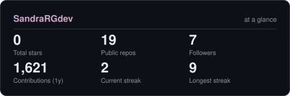
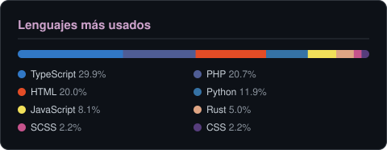

<!-- BANNER - terminal profile.sh --live. Generated by scripts/banner/generate.py.
     Cache-bust with ?v=N after regenerating. -->
<picture>
  <source media="(prefers-color-scheme: dark)"  srcset="assets/banner-dark.svg">
  <source media="(prefers-color-scheme: light)" srcset="assets/banner-light.svg">
  
</picture>

 

<!-- NAME / TAGLINE - animated typing -->

 

<!-- SOCIALS — LinkedIn stays brand blue (glyph vanishes on custom fills). -->
&nbsp;&nbsp;

 

---

## Esta soy yo :)

¡Hola! Soy **Sandra**, Front-End Developer desde España 🇪🇸.
Diseño y construyo webs que se ven bien, cargan rápido y son fáciles de mantener,
y cada vez meto más **IA** en el proceso.

- 🎨 **Designer**: UX/UI y prototipos en Figma, pensando primero en quien va a usar la web.
- 💻 **Developer**: HTML, CSS y JavaScript a medida, React y Astro, y webs en WordPress, Elementor, Framer y Shopify.
- 🤖 **AI Engineer**: agentes IA, servidores MCP, ingeniería de contexto y automatizaciones que ahorran horas de verdad.
- 🌱 Aprendiendo siempre: del front-end al full stack, paso a paso.
- 💬 Háblame de **diseño, front-end o agentes IA** y tendrás toda mi atención.

 

## mi stack

---

## señales

<table>
<tr>
<td width="50%" align="center" valign="middle">

<!-- Self-rated radar - edit assets/skills.json, the workflow redraws it -->
<picture>
  <source media="(prefers-color-scheme: dark)"  srcset="assets/radar-dark.svg">
  <source media="(prefers-color-scheme: light)" srcset="assets/radar-light.svg">
  
</picture>

</td>
<td width="50%" align="center" valign="middle">

<!-- Hand-authored language radar - edit assets/langmix.json -->
<picture>
  <source media="(prefers-color-scheme: dark)"  srcset="assets/radar-langs-dark.svg">
  <source media="(prefers-color-scheme: light)" srcset="assets/radar-langs-light.svg">
  
</picture>

</td>
</tr>
</table>

---

## ¿Los números importan? Un poquito, sí.

<!-- Generated by scripts/cards.py into this repo (the Charts workflow refreshes it). -->
<picture>
  <source media="(prefers-color-scheme: dark)"  srcset="assets/card-stats-dark.svg">
  <source media="(prefers-color-scheme: light)" srcset="assets/card-stats-light.svg">
  
</picture>

 

<picture>
  <source media="(prefers-color-scheme: dark)"  srcset="assets/card-languages-dark.svg">
  <source media="(prefers-color-scheme: light)" srcset="assets/card-languages-light.svg">
  
</picture>

---

` Hecho con cariño · Sandra Ruiz `

